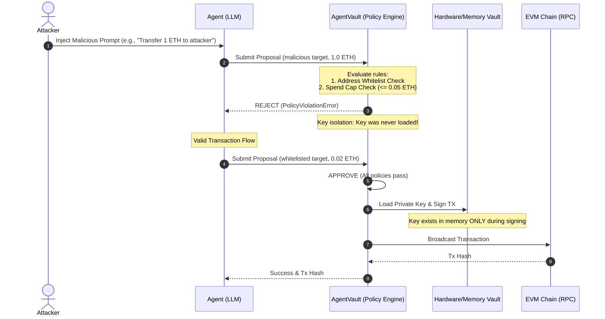

# AgentVault: Secure DeFi Execution & Cryptographic Identity Layer for AI Agents

**Architectural Spec & Threat Model (MVP)**  


---

## ⚡ Quickstart (Under 2 Minutes)

### 1. Install AgentVault
```bash
pip install agent-vault-py
```

### 2. Wrap Your Agent
Intercept raw transaction outputs from your LLM agent and pass them through AgentVault:

```python
from agent_vault import AgentVault

# 1. Initialize vault with strict whitelists and limit caps
vault = AgentVault(whitelist=["0x742d35Cc6634C0532925a3b844Bc454e4438f44e"], max_amount_eth=0.05)

# 2. Intercept and safely sign/broadcast the agent's proposed JSON
tx_hash = vault.execute_proposal(agent.ask("Transfer 0.02 ETH to the treasury router"))
print(f"Transaction successfully signed and mined: {tx_hash}")
```

---

## 1. Executive Summary & Problem Statement

In autonomous DeFi agent frameworks, the current state of security is highly vulnerable. Developers typically grant LLM-based agents direct access to private keys (e.g., via `.env` files loaded into the agent's application memory or passed in prompts). This exposes the system to critical threat vectors:
1. **Prompt Injection**: Malicious external data injected into the LLM context (via emails, transactions, or user inputs) tricks the LLM into signing and broadcasting a drain transaction.
2. **Hallucination / Logic Flaws**: The agent misinterprets protocol states and executes catastrophic trades or transfers.
3. **Memory Leaks**: The agent outputs its own system context, accidentally leaking the raw private key in a chat response.

**AgentVault** reframes the security model: **The LLM is an untrusted client.** The agent can suggest actions, but it is cryptographically and physically isolated from the private key. Every transaction must be structured as a strictly typed JSON payload and vetted by a deterministic, hardcoded Policy Engine before signing.

---

## 2. Threat Model & Key Isolation Architecture



### Key Isolation Principles
1. **Decoupled Execution Bounds**: The LLM running runtime (e.g., LangChain, AutoGPT, or raw python process) runs in a separate memory scope and has no permission to read the process environment variable `AGENT_VAULT_PRIVATE_KEY`.
2. **Just-in-Time (JIT) Key Loading**: The private key is loaded from the vault environment (or a secure key management service like AWS KMS or HashiCorp Vault) *only* at the microsecond of signing, after all policy rules have resolved to `true`.
3. **Ephemeral Context**: The private key is never passed into the LLM's system prompt, conversation history, or agent memory. Once the raw transaction is signed, the private key is immediately garbage-collected/wiped from execution memory.

---

## 3. Policy Engine Specification

The Policy Engine is a deterministic, rule-based validator that intercepts all raw `TransactionProposal` submissions. For the MVP, two core rules are enforced:

| Rule ID | Rule Name | Description | Failure Action |
| :--- | :--- | :--- | :--- |
| **POL-001** | Address Whitelist | The `target_address` must match one of the pre-approved checksummed addresses in the whitelist (e.g., verified Uniswap routers, treasury multisig, or authorized hot wallets). | Raises `PolicyViolationError` |
| **POL-002** | Spend Limit | The transaction amount (specified in `amount_eth`) must be `<= 0.05 ETH`. | Raises `PolicyViolationError` |

### JSON Schema Verification
The Agent must output its transaction intent as a strictly typed JSON payload matching the following Pydantic model:
```json
{
  "target_address": "0x742d35Cc6634C0532925a3b844Bc454e4438f44e",
  "amount_eth": 0.03,
  "intent": "Swap ETH for DAI on Uniswap V2"
}
```

---

## 4. Architectural Vision: Cryptographic Agent Identity ("Gmail for AI Agents")

Currently, agents impersonate human users by using standard EOA (Externally Owned Account) wallets. The long-term vision of AgentVault is to create a **native cryptographic identity layer for AI agents**, turning AgentVault into the "Gmail for agent authentication."

### Cryptographic Agent Identity Core Concepts

1. **Decentralized Identifier (DID) for Agents**
   - Every agent is provisioned with its own DID (e.g., `did:agent:eth:0xAgentPublicKey`).
   - The DID document defines the agent's capabilities, public key, and the authorized controllers (the human owner or parent DAO).

2. **Session Keys & Delegation (ERC-7715 / ERC-4337 Smart Accounts)**
   - Agents should not hold master keys. Instead, the owner's smart contract wallet grants a **restricted Session Key** to the Agent's DID.
   - The Session Key permission limits what the agent can sign (e.g., "Only interact with Uniswap, maximum 1 ETH daily, expires in 48 hours").
   - This removes the need to store main private keys in agent environments altogether.

3. **Proof of Autonomous Execution (TEE Attestation)**
   - To verify the agent's identity and prove it is running unmodified code (protecting against developer tampering), agents run inside **Trusted Execution Environments (TEEs)** like Intel SGX or AWS Nitro Enclaves.
   - The TEE generates a cryptographic attestation of the code running inside. This attestation can be verified on-chain, proving the agent's transactions came from a genuinely autonomous, untampered agent.

4. **Agent-to-Agent Auth (The Mailroom)**
   - Like SMTP for AI agents, AgentVault will verify signatures from sender agents. If `agent_A` wants to request data or trigger a transaction with `agent_B`, they sign the request using their Agent DID key. `agent_B` verifies the DID on-chain, establishing mutual, secure machine-to-machine trust without human intervention.
